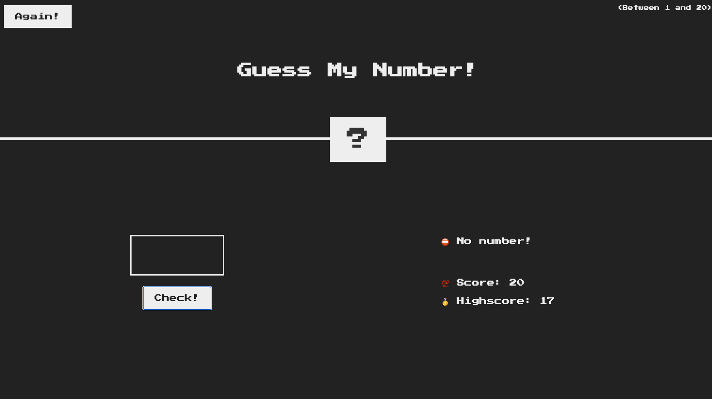
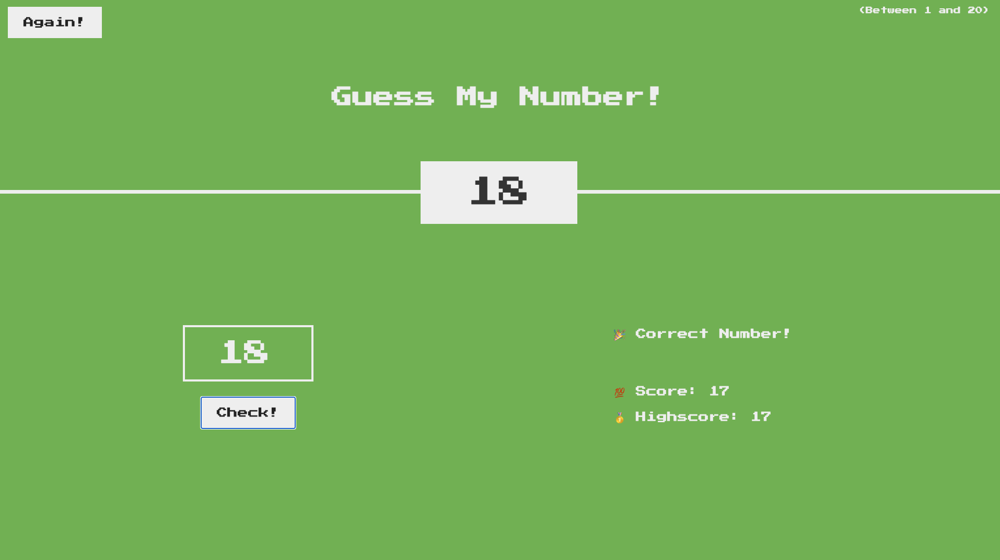

# Guess The Number 

A simple web-based game where players attempt to guess a randomly generated number
between 1 and 20. The game provides feedback on whether the guess is too high,
too low, or correct. Players can also track their score and reset the game.

## Table of Contents
- [Demo](#demo)
- [Features](#features)
- [Installation](#installation)
- [Usage](#usage)
- [Contributing](#contributing)
- [License](#license)
- [Contact](#contact)

## Demo



## Features
- Random number generation between 1 and 20
- Score tracking
- Feedback messages for guesses
- Reset functionality to start a new game
- Responsive design

## Installation
To get a copy of the project up and running on your local machine, follow these steps:

1. Clone the repo:
   ```bash
   git clone https://github.com/username/repo.git

2. Navigate to the project directory:
   cd repo

## Usage
Open the index.html file in your browser to start playing the game. You can enter your guess in the input field and click "Check!" to see if you guessed correctly.

How to Play
Enter a number between 1 and 20.
Click "Check!" to see if your guess is correct.
Use the "Again!" button to reset the game and try again.

## Contributing

Contributions are welcome! Please follow these steps to contribute:
 
1. Fork the project
2. Create your feature branch (git checkout -b feature/AmazingFeature)
3. Commit your changes (git commit -m 'Add some AmazingFeature')
4. Push to the branch (git push origin feature/AmazingFeature)
5. Open a pull request

## License
This project is licensed under the MIT License - see the LICENSE.md file for details.

## Contact
Sagar Suresh Srikant - sgrsuresh57@gmail.com - https://ca.linkedin.com/in/sagarsrikantautomotivehvac

